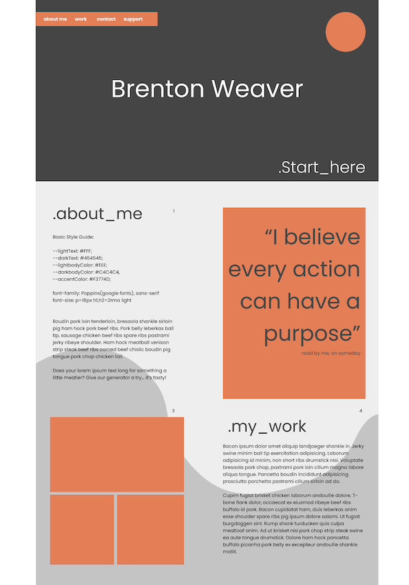

# READ ME - Brenton Weaver portfolio v1

This is the framework for a portfolio that uses HTML and CSS elements to meet the following user story and assessment criteria.

**AS AN** employer
**I WANT** to view a potential employee's deployed portfolio of work samples
**SO THAT** I can review samples of their work and assess whether they're a good candidate for an open position

WHEN I load their portfolio
THEN I am presented with the developer's name, a recent photo or avatar, and links to sections about them, their work, and how to contact them
WHEN I click one of the links in the navigation
THEN the UI scrolls to the corresponding section
WHEN I click on the link to the section about their work
THEN the UI scrolls to a section with titled images of the developer's applications
WHEN I am presented with the developer's first application
THEN that application's image should be larger in size than the others
WHEN I click on the images of the applications
THEN I am taken to that deployed application
WHEN I resize the page or view the site on various screens and devices
THEN I am presented with a responsive layout that adapts to my viewport

| Task | Status |
|--|--|
| Portfolio hosted from github | Complete |
| Name, photo/avatar and links present | Complete |
| Links work to "about me", "work" and "contact"   | Complete |
| Image for first application is larger | Complete |
| Application/works links externally | Complete |
| Site is responsive to different devices | Complete |

**The following build was attempted by Brenton Weaver - Brento20 - brenton.weaver@gmail.com**

 1. Wireframe/Chicken Scribble.
 2. HTML.
 3. .CSS stylesheet planing.
 4. File structure.
 5. Future improvments.

## Wireframe/Chicken Scribble.

## HTML.

 1. Use box structure
 2. Create easily readable code
 3. Include notes 

## .CSS stylesheet planing.

 1. Try out multiple style sheets (coz why not)
 2. Used a reset.css (not self made but open license and github details are linked in the file.)
 3. Include one of each element we covered this week.

## File structure.

 1. List item

## Future improvments.

1. I deviated from the original wire-frame and didn't include a background for the main panel, in a future revision id love to add a scrolling effect that used an wave shape background.
2. The original shape I wanted for the works panel didn't snap well to mobile and I ended up using margins a bit too much, in a future revision ill ad a grid to give it more structure.