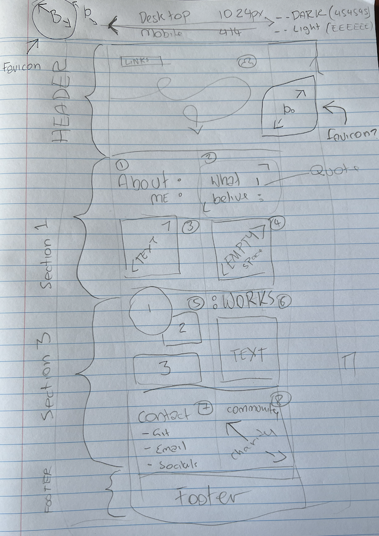

# READ ME - Brenton Weaver portfolio v2

## Description

This is the working portfolio Of Brenton Weaver, created as part of the USYD Coding and Web Development Bootcamp.

LINK TO DEPLOYED APPLICATION : https://brento20.github.io/brenton.weaver/

This is the framework for a portfolio that uses HTML and CSS elements to meet the following user story and assessment criteria.

**AS AN** employer
**I WANT** to view a potential employee's deployed portfolio of work samples
**SO THAT** I can review samples of their work and assess whether they're a good candidate for an open position

| Task | Status |
|--|--|
| Portfolio hosted from github | Complete |
| Name, photo/avatar and links present | Complete |
| Links work to "about me", "work" and "contact"   | Complete |
| Application/works links externally | Complete |
| Site is responsive to different devices | Complete |
| Features 3 example works | Complete |
| Links to GitHub and Linked in | Complete |
| Has a downloadable resume | Complete |
| Has email and phone contact details | Complete |
| Projects are pinned on GitHub | Complete |
| GitHub has about me and a profile pic | Complete |
| Linked In is updated | Complete |

**The following build was attempted by Brenton Weaver - Brento20 - brenton.weaver@gmail.com**

 1. Wireframe/Chicken Scribble.
 2. HTML.
 3. .CSS stylesheet planing.
 4. File structure.
 5. Future improvments.

## Wireframe/Chicken Scribble.

## HTML.

 1. Use bootstrap.
 2. Create easily readable code.
 3. Include multiple HTML files.

## .CSS stylesheet planing.

 1. Try out multiple style sheets (coz why not)
 2. Used a reset.css (not self made but open license and github details are linked in the file.)
 3. Include one of each element we covered this week.

## File structure.

 1. List item

## Future improvments.

1. I deviated from the original wire-frame and didn't include a background for the main panel, in a future revision id love to add a scrolling effect that used an wave shape background.
2. The original shape I wanted for the works panel didn't snap well to mobile and I ended up using margins a bit too much, in a future revision ill ad a grid to give it more structure.

Deployed application:

